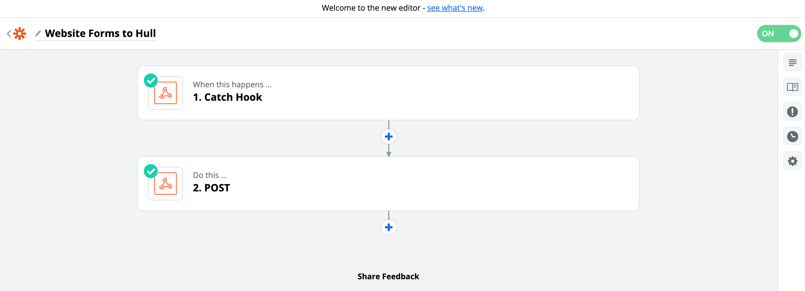
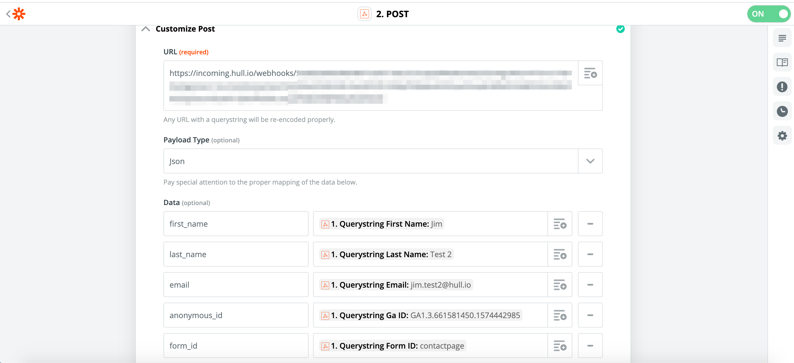
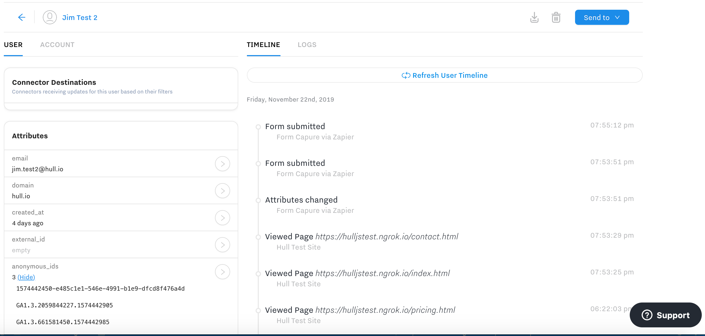

# hulljs-ga-sample

Example how to combine [Google Analytics](https://marketingplatform.google.com/about/analytics/) and [hull.js](https://www.hull.io/docs/reference/hull_js) to track website visitors.

> **TL;DR** This is an example repository which demonstrates the technical implementation of combining Google Analytics and hull.js. It does neither represent the views of my employer nor makes any claims whether you are legally allowed to implement this on your website. Please consult with a lawyer or legal counsel before continuing with any work.

## Requirements

1. You need an account on [Hull](https://www.hull.io/)
2. Install a platform in Hull and get the code snippet
3. You need Google Analytics installed on your website

## Background

We will implement a simple solution which takes the GA cookie, aliases the current user which combines the Hull cookie with the GA cookie.
The website has a contact form which we send to Zapier to perform some additional workflow-like steps before we send the end result via an incoming webhooks connector into Hull. If we do not pass any of the known identifiers along to Zapier, we won't be able to correlate the form submission to the anonymous visitor we captured earlier.

The code to read the GA cookie `_ga` can be found in the [tracking.js](./public/tracking.js) file. For convenience reasons it sets the global window variable `__track_id`, which we leverage in the `contact.js` which is handling form submissions.

The [contact.js](./public/contact.js) file submits the form to a Zapier webhook which can run any complex workflow and will return in the end data to an incoming webhooks connector. See the code in [incoming-webhooks.js](./hull/incoming-webhooks.js) for details. The Zap is for demo purposes just a simple combination of a Catch Hook and Post:

The Post step transforms the form data and relabels the `ga_id` querystring parameter to `anonymous_id` to make it more Hull-like:

That's it, now we have a fully combined tracking experience, which combines cookies from Google Analytics and hull.js plus the incoming webhooks connector automatically identifies users on form submissions:

## References and Inspiration

The following sources were used to compile this example repository:

- [Bootstrap Examples](https://getbootstrap.com/docs/4.3/examples/)
- [Google Dev Guides](https://developers.google.com/analytics/devguides/collection/analyticsjs/cookies-user-id)
- [Bounteous Blog Post](https://www.bounteous.com/insights/2017/08/17/how-google-analytics-uses-cookies-identify-users/)

## License

This repository is licensed under the MIT License. For details see [LICENSE](./LICENSE).

## Limitations

This is not production ready code, but rather to provide you an idea of a working example. Use at your own risk and always follow your developer guidelines.

If you need support for setting up Hull, Zapier or Google Analytics or run into any issues with those tools, please refer to their documentation and get in touch with their respective support teams.
